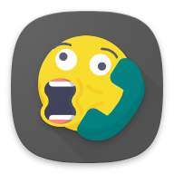
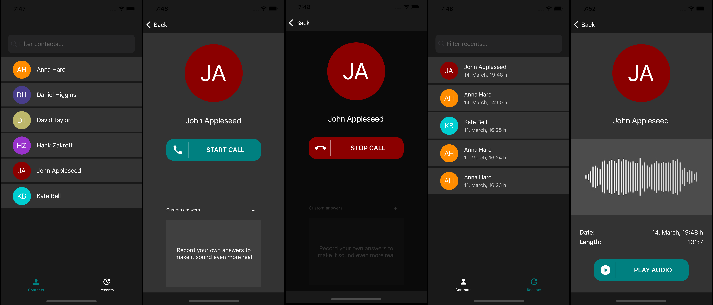
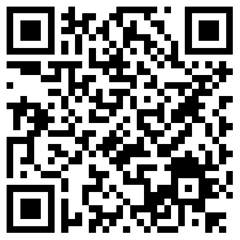

# DrunknDial - my take on F# and Fabulous 

This is a pet project for me to explore the capabilities of F# in combination with [Xamarin](https://docs.microsoft.com/en-US/xamarin/cross-platform/platform/fsharp/) and [Fabulous](https://github.com/fsprojects/Fabulous). I decided to put it on github so it might serve someone as little example to see what's possible with these technologies.

 

 

## About the app
The idea of the app was suggested by a friend and one could say it's rather silly. Imagine you went out with a couple of friends to get a few drinks. Later that evening one of them had one or two drinks too much and is now eager to make a phone call. Since talking doesn't seem to be one of his strong suits anymore a phone call might not be the best idea. This is were DrunknDial comes in. It mirrors an usual dialer app, but instead of making a real phone call it just simulates it by displaying a proper dialer UI and plays back random voice sounds as if someone would be answering the call. And that's not all! In addition the app will record whatever your drunk friend was babbling about, so you can listen and show it to him at the next day (or whenever he regained his consciousness..).

## Features
- contact list with filter
- overview of recent "calls" with filter
- voice recording of the caller gets persisted as recent "call"
- customizable random answers during "call"

## How to get the app

On android just download the [.apk](https://github.com/TobiasBuchholz/DrunknDial/raw/main/dist/app.apk) file or use the QR-code below:

 

 

On iOS you'll need to checkout the project and build it by yourself which shouldn't be a problem.